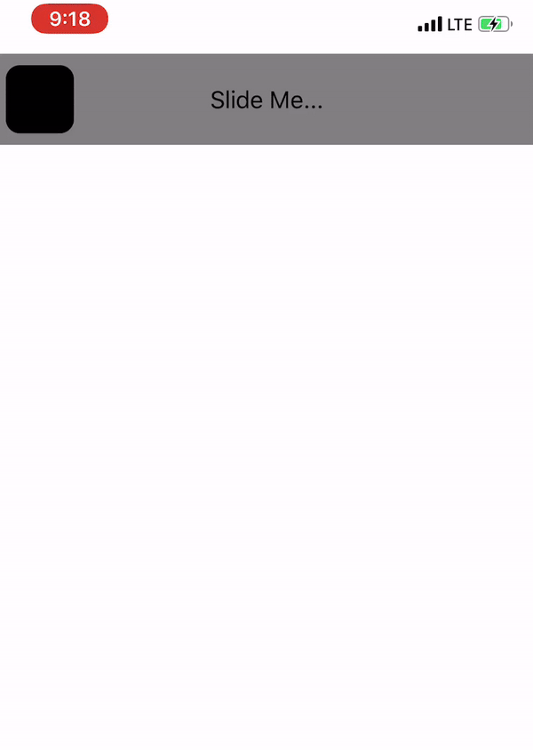

# Lope

<!-- Markdown link & img dfn's -->
[travis-image]: https://img.shields.io/travis/dbader/node-datadog-metrics/master.svg?style=flat-square
[]()
[

[](https://github.com/matteocrippa/awesome-swift#json)


[](http://cocoadocs.org/docsets/EVReflection)

[](https://developer.apple.com/swift)

[](https://github.com/adieolami)
[](http://twitter.com/adieolami)
[](http://linkedin.com/in/olalekan-adie-16579b99)
[](mailto:ugbeadie@gmail.com?SUBJECT=About%Lope)


> This is an easy and Elegant SliderView which you can easily implemet in your application.

[![Build Status][travis-image]][travis-url]

Lope gives you a smooth and easy experience when implemeting in your app. It is easy to customize and modify.



## Installation

Cocoapods:

```
pod install 'Lope'
```

Cartage:

```
Coming Soon
```


## Usage example


<!--_For more examples and usage, please refer to the [Wiki][wiki]._-->

## Development setup

### Initiate Lope in your UIViewController like this

    import Lope
    
    var lope: Lope!
    

### call the lope in your viewDidLoad and access other properties
    override func viewDidLoad() {
        super.viewDidLoad()

        view.backgroundColor = .white
        lope = Lope(frame: CGRect.zero)
        lope.delegate = self
        lope.translatesAutoresizingMaskIntoConstraints = false
        self.view.addSubview(lope)
        setup()

    }
    
### Programmatically: create your function give it any name 

    func setup() {

        NSLayoutConstraint.activate([
        //            lope.centerXAnchor.constraint(equalTo: view.centerXAnchor, constant: 0),
        //            lope.centerYAnchor.constraint(equalTo: view.centerYAnchor, constant: 0),

        lope.topAnchor.constraint(equalTo: view.safeAreaLayoutGuide.topAnchor, constant: 0),

        lope.leadingAnchor.constraint(equalTo: view.leadingAnchor, constant: 0),
        lope.trailingAnchor.constraint(equalTo: view.trailingAnchor, constant: 0),
        lope.heightAnchor.constraint(equalToConstant: 64),
        ])
    }

### Delegate method on what to do on completion

    extension ViewController: LopeDelegate {
        func startSlide(_ start: Bool) {
            print("startSlide Lope")
        }

        func endSlide(_ end: Bool) {
            print("endSlide Lope")
            if end {
                let alert = UIAlertController(title: "Lope", message: "Slide Done", preferredStyle: UIAlertController.Style.alert)
                alert.addAction(UIAlertAction(title: "OK", style: UIAlertAction.Style.default, handler: nil))
                self.present(alert, animated: true, completion: nil)
            }
        }

    }
### Other accessible variables

    sliderBackgroundColor: UIColor? = .black
    baseViewBackgroundColor: UIColor? = .gray
    titleTextColor: UIColor? = .black

## Release History

* 0.0.1
* CHANGE: Update docs (module code remains unchanged)


## Meta

Adie Olalekan – [@AdieOlami](https://twitter.com/AdieOlami) – ugbeadie@gmail.com

Distributed under the MIT license. See ``LICENSE`` for more information.

[https://github.com/AdieOlami/Lope](https://github.com/AdieOlami/)

## Contributing

1. Fork it (<https://github.com/AdieOlami/Lope/fork>)
2. Create your feature branch (`git checkout -b feature/fooBar`)
3. Commit your changes (`git commit -am 'Add some fooBar'`)
4. Push to the branch (`git push origin feature/fooBar`)
5. Create a new Pull Request

